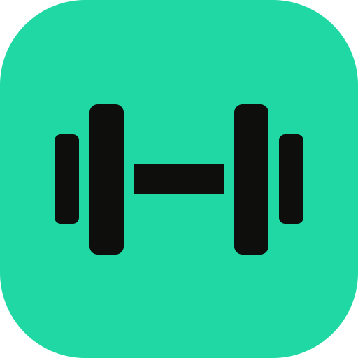

<div align="center">



# KeishaGym

**A gym & body-weight tracker that trains with you.**

Plan your week, run guided workouts, log every set, and let an optional AI coach adjust the
plan from what you actually did — on your phone, synced across your devices.


</div>

KeishaGym is a fork of [openGym](https://github.com/DuarteSantos8/openGym) by Duarte Santos,
rebuilt on Supabase and carrying its own exercise library, identity and AI coach.

## What it does

**Training**

- **Weekly plan** — a routine per weekday, over a library of **873 exercises**, each with a
  two-photo demo of the movement (start and end, alternating)
- **Guided workouts** — it knows what day it is, pre-fills the weights you used last time,
  keeps the screen awake, times your rest, and detects PRs
- **Progression that follows a rule** — linear, Greyskull LP, double progression through a rep
  range, or added time. Every target says *why* it is that number; missed reps never advance
  the load, and stalls trigger a deload
- **Supersets, timed holds and cardio** — logged as what they are, not forced into weight × reps
- **Effort per set** — optional RIR or RPE, in the scale you already think in
- **Estimated 1RM** — per exercise, from your best eligible set, with its own curve

**Tracking**

- **Body weight** with a goal line, **activity heatmap**, **muscle map** (what you trained, and
  what you have been neglecting), history, PRs and per-exercise charts

**Around it**

- **Your own exercises**, plan sharing and PDF printing, imports from **Strong**, **Hevy**,
  **FitNotes** and **Apple Health**, JSON export/import
- **12 languages**, light/dark themes, no ads, no tracking, no telemetry

**Optional: the AI Coach**

A short intake produces a complete weekly plan you can refine in plain language. On demand or
on a schedule it reads your stalls, effort ratings, adherence and body-weight trend, and
proposes **discrete, explained changes you accept one by one** — each with a before → after and
the evidence behind it. Every accepted change-set is snapshotted and revertible, and the
deterministic progression engine still owns your session-to-session weights.

It runs as a Supabase Edge Function under **your own** Anthropic API key, is off until you
deploy it, and needs each profile's consent. See [docs/COACH_DEPLOY.md](docs/COACH_DEPLOY.md).

## How it is built

| | |
|---|---|
| **App** | React 19 + Zustand, a PWA you can install; the same code ships as a native app through Capacitor |
| **Accounts & sync** | Supabase Auth + Postgres. The app keeps its state on the device and syncs it, so a session in a basement gym works offline |
| **AI Coach** | a Supabase Edge Function calling the Anthropic API |
| **Serving** | any static host — or the included `docker compose` (nginx + the exercise photos) |

Data belongs to the person who logged it: your own Supabase instance can be self-hosted, every
table is protected by row-level security, and the app can delete an account and its data from
inside the app.

## Run it locally

```sh
npm run dev
```

Without a Supabase configuration the app runs device-only: no accounts, no sync, everything
stays in the browser. To connect it to your own instance, copy `frontend/.env.example` to
`frontend/.env.local` and fill in the URL and the anon key.

Serve it (app + exercise photos) with Docker:

```sh
cp .env.example .env    # then set WEB_PORT and your Supabase values
docker compose up -d
```

- **[docs/SELF_HOSTING.md](docs/SELF_HOSTING.md)** — hosting the app and its Supabase
- **[docs/COACH_DEPLOY.md](docs/COACH_DEPLOY.md)** — deploying the AI Coach
- **[docs/MOBILE.md](docs/MOBILE.md)** — building the Android / iOS app

## Repository

| | |
|---|---|
| `frontend/` | the app — React, Capacitor projects for Android and iOS |
| `supabase/migrations/` | the database: synced state, Coach state, row-level security |
| `supabase/functions/coach/` | the AI Coach (payload building, validation, prompts) |
| `scripts/` | generators: exercise dataset, Coach catalogue and prompts, brand icons |
| `web/` | nginx image that builds and serves the app |
| `assets/brand/` | the KeishaGym identity (logo, palette, type) |

## Licence & credits

KeishaGym is **AGPL-3.0**, like the project it forks. See [NOTICE.md](NOTICE.md) for the full
picture:

- **openGym** by Duarte Santos — the app this is built on
- **[free-exercise-db](https://github.com/yuhonas/free-exercise-db)** — exercises, instructions
  and photos, in the public domain (Unlicense)
- **[MuscleMap](https://github.com/melihcolpan/MuscleMap)** — the body-map artwork (MIT)
